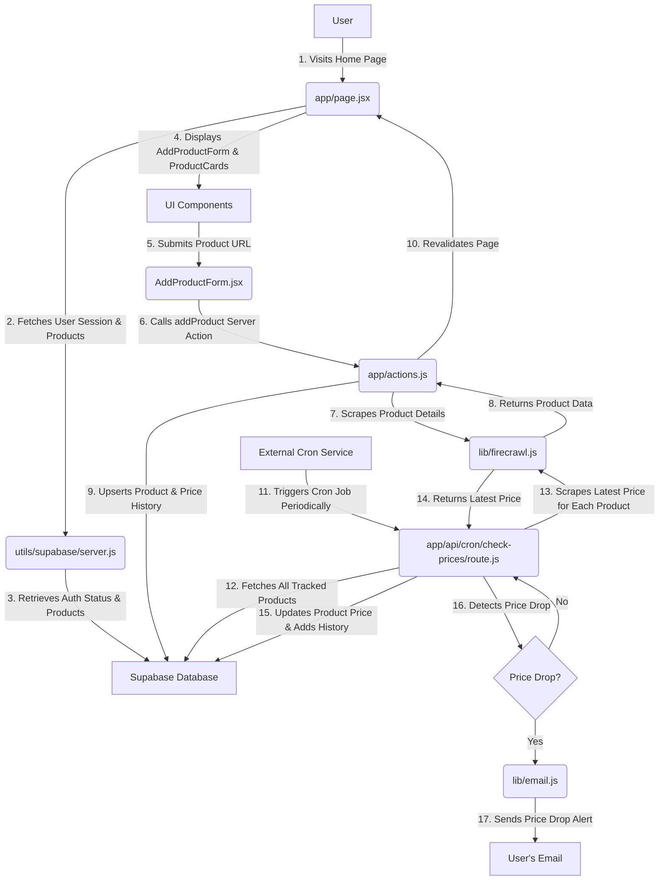

# Price Drop Tracker

A simple application to track price drops of products from various e-commerce sites and notify users when prices drop.

## Features

*   **Product Tracking:** Add and track products from any e-commerce site.
*   **Price Monitoring:** Automatically monitors product prices periodically.
*   **Price Drop Alerts:** Receive instant email notifications when a tracked product's price drops.
*   **Price History:** View a historical graph of price changes for each product.
*   **User Authentication:** Secure user authentication using Supabase.

## Technology Stack

*   **Next.js:** React framework for building full-stack web applications.
*   **React:** Frontend library for building user interfaces.
*   **Tailwind CSS:** Utility-first CSS framework for styling.
*   **Supabase:** Open-source Firebase alternative for database (PostgreSQL), authentication, and more.
*   **Firecrawl:** Web scraping API for extracting product information.
*   **Resend:** For sending email notifications.

## Project Structure

```
.
├── app/                  # Next.js application routes, API endpoints, and server actions
│   ├── actions.js        # Server actions for product management and authentication
│   ├── api/              # API routes (e.g., cron job for price checks)
│   ├── auth/             # Authentication callback routes
│   └── page.jsx          # Main application page
├── components/           # React components
│   ├── ui/               # Reusable UI components (shadcn/ui)
│   ├── AddProductForm.jsx  # Form for adding new products
│   ├── AuthButton.jsx      # Authentication UI button
│   ├── ProductCard.jsx     # Displays individual product information
│   └── PriceChart.jsx      # Displays product price history
├── lib/                  # Utility and helper functions
│   ├── email.js          # Email sending utilities (Resend)
│   └── firecrawl.js      # Firecrawl integration for web scraping
└── utils/                # Project-wide utilities
    └── supabase/         # Supabase client configurations for client and server
        ├── client.js
        └── server.js
```

## Data Flow

The Price Drop Tracker application follows a clear data flow, involving user interactions, server-side logic, and automated background processes.



**Detailed Data Flow:**

1.  **User Visits Home Page:** A user accesses the application's home page (`app/page.jsx`).
2.  **Fetches User Session & Products:** The `app/page.jsx` component, running on the server, uses `utils/supabase/server.js` to create a Supabase client.
3.  **Retrieves Auth Status & Products:** The Supabase client fetches the user's authentication status and their tracked products from the **Supabase Database**.
4.  **Displays UI Components:** Based on the fetched data, the UI components (`AddProductForm.jsx` and `ProductCard.jsx`) are rendered on `app/page.jsx`.

5.  **User Submits Product URL:** An authenticated user enters a product URL into the `AddProductForm.jsx`.
6.  **Calls `addProduct` Server Action:** The form submission triggers the `addProduct` server action in `app/actions.js`.
7.  **Scrapes Product Details:** The `addProduct` action calls `scrapeProduct` in `lib/firecrawl.js` to extract product name, current price, currency, and image URL from the provided URL.
8.  **Returns Product Data:** `lib/firecrawl.js` returns the scraped product data to `app/actions.js`.
9.  **Upserts Product & Price History:** `app/actions.js` then upserts (inserts or updates) the product information into the `products` table in the **Supabase Database**. If it's a new product or the price has changed, a new entry is added to the `price_history` table.
10. **Revalidates Page:** Finally, `app/actions.js` revalidates the home page, triggering a re-fetch of the product list and updating the UI to display the newly added or updated product.

11. **External Cron Service Triggers Cron Job:** Periodically, an external cron service (e.g., Vercel Cron Jobs) sends a `POST` request to the `app/api/cron/check-prices/route.js` endpoint.
12. **Fetches All Tracked Products:** The cron job uses a Supabase service role client (bypassing RLS) to fetch all products currently being tracked from the **Supabase Database**.
13. **Scrapes Latest Price for Each Product:** For each tracked product, `app/api/cron/check-prices/route.js` calls `scrapeProduct` in `lib/firecrawl.js` to get the latest price from the product's URL.
14. **Returns Latest Price:** `lib/firecrawl.js` returns the latest price data to the cron job.
15. **Updates Product Price & Adds History:** The cron job updates the `current_price` of the product in the `products` table and adds a new entry to the `price_history` table if the price has changed.
16. **Detects Price Drop:** The cron job checks if the `newPrice` is less than the `oldPrice`.
17. **Sends Price Drop Alert:** If a price drop is detected, the cron job uses `lib/email.js` to send an email notification to the user, alerting them of the price drop.

## Getting Started

To get started with the Price Drop Tracker, follow these steps:

1.  **Clone the repository:**
    ```bash
    git clone https://github.com/your-username/price-drop-tracker.git
    cd price-drop-tracker
    ```
2.  **Install dependencies:**
    ```bash
    npm install
    ```
3.  **Set up Supabase:**
    *   Create a new project on [Supabase](https://supabase.com/).
    *   Set up your database schema with `products` and `price_history` tables. You'll need columns for `user_id`, `url`, `name`, `current_price`, `currency`, `image_url`, `updated_at` for `products`, and `product_id`, `price`, `currency`, `checked_at` for `price_history`.
    *   Configure authentication (e.g., Email/Password).
    *   Retrieve your Supabase URL, Public Anonymous Key, and Service Role Key.
4.  **Configure Environment Variables:**
    Create a `.env.local` file in the root of your project with the following variables:
    ```
    NEXT_PUBLIC_SUPABASE_URL=YOUR_SUPABASE_URL
    NEXT_PUBLIC_SUPABASE_PUBLISHABLE_KEY=YOUR_SUPABASE_ANON_KEY
    SUPABASE_SERVICE_ROLE_KEY=YOUR_SUPABASE_SERVICE_ROLE_KEY
    FIRECRAWL_API_KEY=YOUR_FIRECRAWL_API_KEY
    RESEND_API_KEY=YOUR_RESEND_API_KEY
    CRON_SECRET=YOUR_CRON_SECRET_KEY
    ```
    *   `FIRECRAWL_API_KEY`: Obtain this from [Firecrawl](https://www.firecrawl.dev/).
    *   `RESEND_API_KEY`: Obtain this from [Resend](https://resend.com/).
    *   `CRON_SECRET`: A secret key for authenticating your cron job requests.
5.  **Run the development server:**
    ```bash
    npm run dev
    ```
    Open [http://localhost:3000](http://localhost:3000) in your browser.

## Deployment

This application can be deployed on platforms like Vercel. Remember to configure your environment variables and set up Vercel Cron Jobs to trigger the price checking API route (`/api/cron/check-prices`) periodically.
